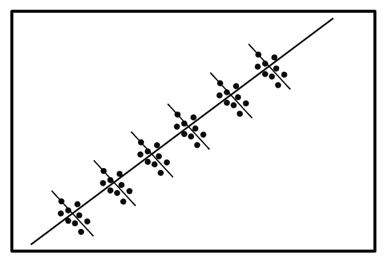

```{r setup, include=FALSE}
knitr::opts_chunk$set(echo = TRUE)
```

## Intro to R 

```{r}
# install.packages('tidyverse')
# install.packages('lme4', type = 'source')
# install.packages("Matrix")
library(tidyverse)
library(lme4)
```

```{r}
load("dragons.RData")
head(dragons)
```

## Mixed Effects Regression
A mixed effects model contains both **fixed effects** and **random effects.** A fixed effect is a parameter that does not vary. Random effects are parameters that are random variables. 


It follows the same assumptions are standard OLS regression:
1. linearity
2. no outliers
3. homoscedasticity
4. residuals are normally distributed
5. no multicollinearity

You should consider using a mixed effects model when you have **repeated measures from the same unit of observation.**


```{r}
dragons$bodyLength2 <- scale(dragons$bodyLength, center = TRUE, scale = TRUE)
mixed.lmer <- lmer(testScore ~ bodyLength2 + (1|mountainRange), data = dragons)
summary(mixed.lmer)
```


## Multinomial Logistic Regression (Discrete Choice Model)

*Logistic regression*: Models binary outcomes.
*Multinomial logistic regression*: The model to use when your outcome variable takes one of several options.
- **Example**: A consumer has the option to purchase a product from one of several brands.

### Applications
- Market share and pricing analysis (how would increasing prices affect market share?)
- New technology adoption (what factors influence the adoption of a new technology?)
- Competitive analysis (how do product/service features influence consumer preferences?)

```{r}
library(mlogit) # Note the multinom function from the nnet package does not require reshaping dataMi
library(caret)
print('hello world')

```

```{r}

```


